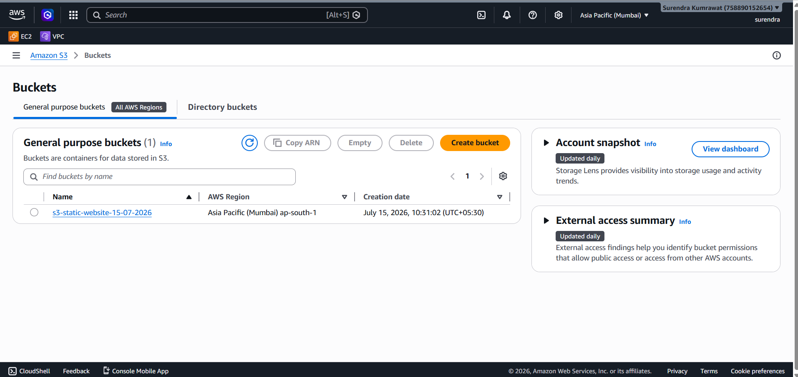
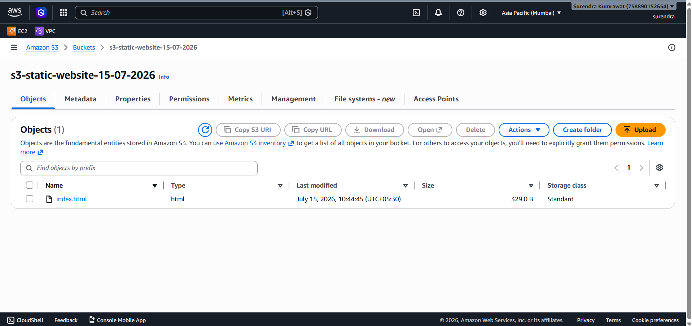
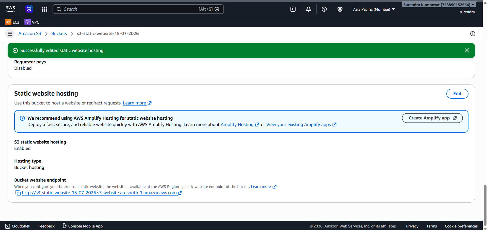
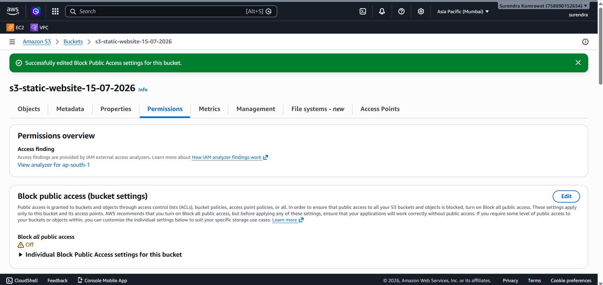
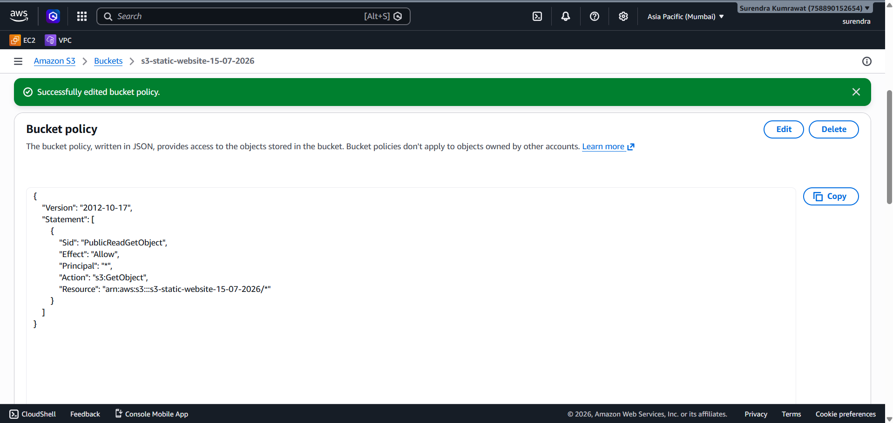
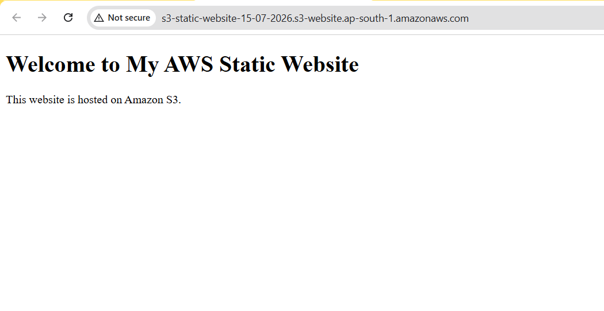

# AWS Static Website Hosting using Amazon S3

## Project Overview

This project demonstrates how to host a static website using Amazon S3 Static Website Hosting. The website is publicly accessible through the S3 Website Endpoint.

---

## AWS Services Used

- Amazon S3
- Static Website Hosting
- Git
- GitHub

---

## Project Architecture

```text
User
   │
   ▼
Web Browser
   │
   ▼
Amazon S3 Bucket
   │
   ▼
index.html
```

---

## Project Steps

1. Create an Amazon S3 Bucket.
2. Upload the website files.
3. Enable Static Website Hosting.
4. Disable Block Public Access.
5. Add a Bucket Policy.
6. Open the S3 Website Endpoint.
7. Verify the live website.
8. Upload the project to GitHub.

---

## Repository Structure

```text
AWS-Static-Website-Hosting
│
├── Website
│   └── index.html
│
├── Screenshots
│   ├── 01-s3-bucket-created.png
│   ├── 02-files-uploaded.png
│   ├── 03-static-website-hosting-enabled.png
│   ├── 04-block-public-access-disabled.png
│   ├── 05-bucket-policy-added.png
│   └── 06-live-website.png
│
├── Commands
│   └── commands.md
│
├── Architecture
│   └── architecture.md
│
└── README.md
```

---

## Features

- Static Website Hosting using Amazon S3
- Public Website Access
- Bucket Policy Configuration
- Git and GitHub Integration
- Professional Project Documentation

---

## Skills Learned

- Amazon S3
- S3 Static Website Hosting
- S3 Bucket Policy
- Git
- GitHub
- Markdown Documentation

---

## Project Workflow

```text
Developer
    │
    ▼
Visual Studio Code
    │
    ▼
Git
    │
    ▼
GitHub
    │
    ▼
Amazon S3
    │
    ▼
Live Website
```

---

## Prerequisites

Before starting this project, you should have:

- An AWS Account
- A GitHub Account
- Visual Studio Code
- Git Installed
- Basic Knowledge of HTML

---

## Screenshots

### 1. S3 Bucket Created



### 2. Files Uploaded



### 3. Static Website Hosting Enabled



### 4. Block Public Access Disabled



### 5. Bucket Policy Added



### 6. Live Website



---

## Author

**Surendra Kumrawat**